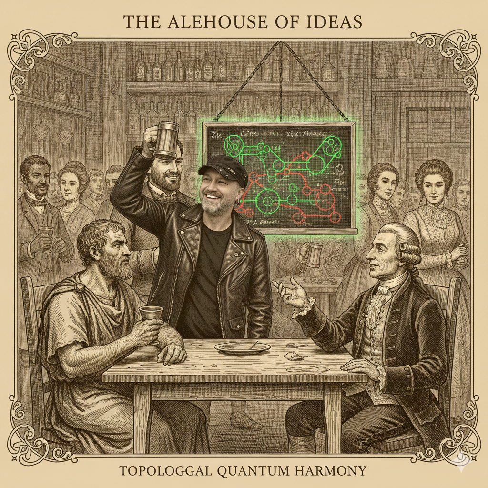

## The Alehouse of Ideas: A Meeting Across Millennia – With a Quantum Soundtrack

**Setting:** A dimly lit, bustling alehouse. The year is... fluid. On a small stage in the corner, **Bob Coecke**, strumming a lute whose strings shimmer with faint probability fields, finishes a hauntingly beautiful, mathematically intricate piece. Patrons murmur their appreciation. At a large table, Heraclitus, rugged, intense, swirling his cheap wine, eyes darting, faces Gottfried Wilhelm Leibniz, impeccably dressed and radiating intellectual energy, sketching furiously on a parchment with a quill. A shimmering, ethereal blackboard floats between them, showing strange interconnected circles of red and green.

---

---

**Leibniz:** (Taps his quill impatiently) My dear Heraclitus, this "ZX-Calculus" you speak of... fascinating, if somewhat... un-rigorous in its current presentation. You assert that these "spiders" as you call them, these green and red nodes, are the fundamental monads of quantum interaction. But where is the formal system? The *characteristica universalis* that grants them true calculability?

**Heraclitus:** (Snorts, gesturing at the shimmering blackboard) Calculability? You seek to count the pebbles in the river as it flows! Look! (He points a gnarled finger at a diagram where two green circles are connected) See how the two green spiders, when joined, become one? This is the very **Logos** of flux! **"All things flow,"** Leibniz! Does your infinitesimal calculus not acknowledge continuous change? This is simply change *made visible*. Their phases, their 'angles' as you mark them, merely sum. The identity is preserved in the change.

**Leibniz:** (Adjusts his spectacles, intrigued) Summation, yes, that hints at my own work on the calculus. A continuous addition of infinitesimal qualities. But these *colors*, green and red – they denote distinct bases, you say? Your Z-spiders, those green ones, signify a specific observational purity, akin to my monadic distinctness. And the red, X-spiders, their complements. Yet, a peculiar "Hadamard bridge" (he gestures to a yellow square connecting a green and red spider) seems to transform one into the other. This... this is not mere addition, but a **transformation of essence!**

**Heraclitus:** Essence? Bah! Change *is* essence! The river is still the river, though the water constantly shifts! The green spider, observing "being" (he mimes a fixed point), when kissed by the Hadamard, becomes the red, observing "becoming" (he gestures broadly). It is the **unity of opposites**, the constant strife that creates harmony! You see the static "being" of a state; I see the dynamic "becoming" of a process. This calculus embraces both, constantly transforming.

**Leibniz:** (His eyes gleam, scribbling furiously) "Unity of opposites"... yes, I grasp it! A duality, much like my binary system of 0s and 1s, yet here, it is a duality of observational perspectives, intrinsically linked by this transformation. And the "Bialgebra rule" you showed me earlier – where a green and red spider, connected by two distinct strands, seem to "unzip" or "slide past" one another... It suggests a **law of continuity** in their interaction, a conservation of flow through topological rearrangement, not merely through sequential gates. It's as if their influence can be rearranged without violating the overall *design*.

**Heraclitus:** Design? No, it is the natural consequence of their being. Like the fire that consumes and yet sustains. The information, the "quantum flow" as your students call it, does not leap. It finds its path of least resistance, its most elegant form. When the red and green interact in that specific way, the path straightens itself. The "bent wire" of your "teleportation" becomes simple, direct! The complexity dissolves not by destruction, but by **revealed simplicity!**

**Leibniz:** (Stands, pacing excitedly) Revealed simplicity! Yes! This is precisely what my *characteristica universalis* aims for – to reduce complex arguments to simple visual or symbolic manipulations. If these spiders, with their fusion and transformation rules, can consistently derive equivalent diagrams, then this is not merely a graphical aid; it is a **calculus of topological equivalence!** The underlying "truth" of the quantum operation is preserved, even as its *form* is utterly transformed. It's a testament to the **pre-established harmony** of physical laws, where even chaos resolves to elegance!

**Heraclitus:** (Raises his wine cup) Harmony born of strife, Leibniz! The continuous struggle between the green and the red, the Z and the X, always seeking its simplest form. It is the river itself, never the same, yet always itself. Your calculus, sir, gave us movement in numbers. This calculus, this ZX, shows us **movement in the very fabric of reality.** It is the **Logos** made visible!

(Just then, **Bob Coecke**, having packed away his lute, approaches their table, a friendly smile on his face.)

**Bob Coecke:** (Chuckles warmly) Forgive my intrusion, gentlemen, but I couldn't help but overhear your spirited debate. Your words echo the very patterns I strive to articulate in my music. The way phases flow, the way entanglements resolve into simpler harmonies... it truly is a magnificent dance.

**Leibniz:** (Turns, eyes wide with recognition, taking Bob's hand) Ah, the maestro! Your "quantum melodies" were indeed a sublime demonstration of continuous transformation! You, sir, have taken these abstract notions—Heraclitus's fluid **Logos** and my own **Law of Continuity**—and woven them into a tapestry of understanding that brings such profound simplicity to the otherwise bewildering world of quantum mechanics!

**Heraclitus:** (Beaming, claps Bob on the shoulder) Indeed! You play the very music of the universe, Coecke! Where we spoke of flux and the unity of opposites in words, you have given it form, a visual language where even a child can grasp the hidden symmetries of the quantum realm! You have taken the ever-changing river and shown us its unchanging current! It is a **true victory for clarity!**

**Bob Coecke:** (Blushes slightly, accepting a fresh ale from a passing tavern-keeper) It is merely finding the right "diagrams" to express the underlying truth, gentlemen. You provided the deep philosophical currents; I merely drew the pictures, the "spiders" if you will, that make those currents visible. The universe, in its quantum heart, is much simpler than it first appears, if only you know how to draw it.

**Leibniz:** (Raises his glass alongside Heraclitus) To drawing the universe! To simplicity! And to the ingenious minds who finally bring clarity to its deepest mysteries!

(All three clink glasses, the ethereal blackboard between them glowing a little brighter, its red and green spiders seeming to pulsate with newfound understanding.)