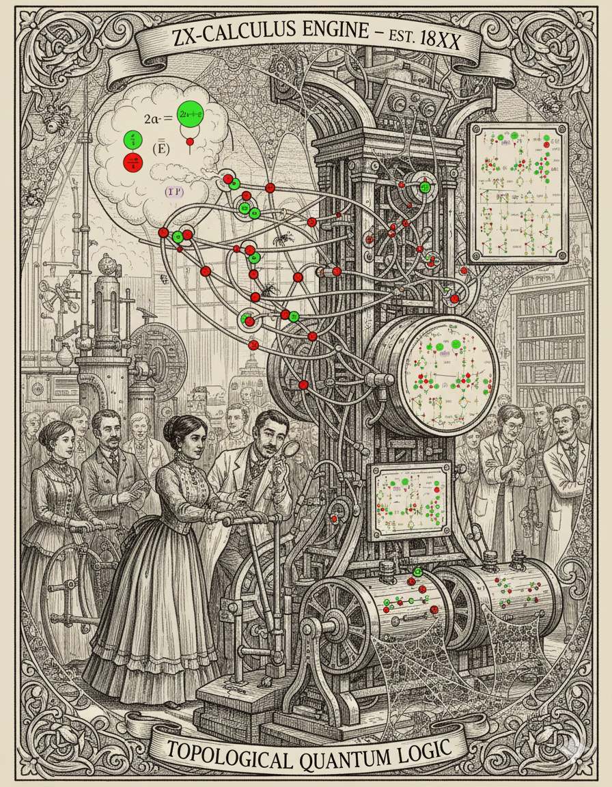

# ZX-Calculus: A Practical Demonstration

A comprehensive guide to quantum circuit optimization using the ZX-calculus, featuring interactive examples with PyZX.



## Overview

The ZX-calculus is a powerful graphical language for quantum reasoning that represents quantum circuits as flexible graphs of "spiders" (nodes) and wires. Unlike traditional circuit notation based on matrices, ZX-calculus allows for topological simplifications that are often impossible to see in standard representations.

See [Introduction to ZX Calculus](./INTRODUCTION-TO-ZX-CALCULUS.md)

This package demonstrates:

- **Hidden Identity Detection**: Automatically detecting when complex circuits cancel out
- **Quantum Teleportation Visualization**: Proving teleportation is topologically a "bent wire"
- **T-Count Reduction**: Optimizing expensive T-gates for fault-tolerant quantum computing
- **Random Circuit Optimization**: Stress-testing the calculus on unstructured circuits

## Prerequisites

- Python 3.8 or higher
- pip (Python package installer)
- (Optional) Jupyter Notebook experience

## Quick Start

### Option 1: Automated Setup (Recommended)

```bash
# Clone or download this repository
cd zx-calculus-demo

# Run the setup script
bash setup.sh

# Activate the virtual environment
source venv/bin/activate  # Linux/Mac
# or
venv\Scripts\activate     # Windows

# Launch Jupyter
jupyter notebook
```

### Option 2: Manual Setup

```bash
# Create virtual environment
python3 -m venv venv
source venv/bin/activate

# Install dependencies
pip install -r requirements.txt

# Launch Jupyter
jupyter notebook
```

## Package Contents

```
zx-calculus-demo/
├── README.md                              # This file
├── INTRODUCTION-TO-ZX-CALCULUS.md        # Deep dive into ZX-calculus theory
├── requirements.txt                       # Python dependencies
├── setup.sh                              # Automated setup script
├── zx_calculus_demo.ipynb                # Main Jupyter notebook
└── examples/                             # Optional standalone scripts
    ├── 01_hidden_identity.py
    ├── 02_teleportation.py
    ├── 03_t_count_reduction.py
    └── 04_random_clifford_t.py
```

## Using the Notebook

Open `zx_calculus_demo.ipynb` in Jupyter. The notebook is organized into sections:

1. **Setup and Imports** - Initialize PyZX and visualization tools
2. **Hidden Identity** - Simplify a complex circuit that does nothing
3. **Visualizing Teleportation** - See the "bent wire" topology
4. **T-Count Reduction** - Optimize expensive fault-tolerant gates
5. **Random Circuit Stress Test** - Full-scale optimization demonstration

Each section is self-contained with explanations, code, and visualizations.

## Key Concepts

### What is ZX-Calculus?

ZX-calculus replaces quantum gates with two types of "spiders":
- **Green (Z) spiders**: Operate in the computational basis
- **Red (X) spiders**: Operate in the Hadamard basis

### Three Golden Rules

1. **Spider Fusion**: Spiders of the same color fuse together
2. **Color Change**: Hadamard gates flip spider colors
3. **Topological Freedom**: Only connectivity matters, not spatial layout

### Why Use ZX-Calculus?

- **Circuit Optimization**: Reduce gate counts automatically
- **T-Count Minimization**: Critical for fault-tolerant quantum computing
- **Equivalence Checking**: Prove circuits are identical topologically
- **Intuitive Visualization**: See quantum information flow directly

## Industry Applications

### Fault-Tolerant Quantum Computing

In FTQC, T-gates require expensive "magic state distillation." PyZX can reduce T-counts by 30-50%, representing massive hardware savings.

### Quantum Compiler Optimization

Major quantum computing platforms (IBM, Google, IonQ) use ZX-inspired optimizations in their compilation stacks.

### Quantum Algorithm Development

ZX-calculus helps researchers design new algorithms by revealing hidden structure in quantum circuits.

## Learning Resources

### Included Documentation
- `INTRODUCTION-TO-ZX-CALCULUS.md` - Comprehensive theory guide

### External Resources
- [PyZX Documentation](https://pyzx.readthedocs.io/)
- [ZX-Calculus Paper](https://arxiv.org/abs/0906.4725) (Coecke & Duncan)
- [Quantomatic Project](https://quantomatic.github.io/)

### Academic Background
- **Categorical Quantum Mechanics**: The mathematical foundation
- **String Diagrams**: The graphical notation system
- **Frobenius Algebras**: The algebraic structure underlying spiders

## Troubleshooting

### Import Errors
```bash
# Ensure you're in the virtual environment
which python  # Should show path to venv/bin/python

# Reinstall dependencies
pip install -r requirements.txt --force-reinstall
```

### Visualization Issues
```bash
# Install matplotlib backend support
pip install ipympl

# In Jupyter, use:
%matplotlib inline
```

### PyZX Version Issues
```bash
# Check version
python -c "import pyzx; print(pyzx.__version__)"

# Should be 0.7.3 or higher
```

## Contributing

This is an educational demonstration package. Suggestions for improvements:

- Additional examples (Grover's algorithm, QFT simplification)
- Integration with other frameworks (Cirq, PennyLane)
- Performance benchmarking scripts
- Advanced visualization techniques

## Credits

### Frameworks
- **PyZX**: Aleks Kissinger, John van de Wetering
- **ZX-Calculus**: Bob Coecke, Ross Duncan

### This Package
Created as a comprehensive educational resource for quantum computing researchers and practitioners.

## License

This demonstration package is provided for educational purposes. PyZX is licensed under the Apache 2.0 License.

## Citation

If you use this package in academic work, please cite:

```bibtex
@article{kissinger2019pyzx,
  title={PyZX: Large Scale Automated Diagrammatic Reasoning},
  author={Kissinger, Aleks and van de Wetering, John},
  journal={arXiv preprint arXiv:1904.04735},
  year={2019}
}
```

## Contact & Support

For issues with:
- **PyZX**: Visit [PyZX GitHub](https://github.com/Quantomatic/pyzx)
- **This Package**: Check the documentation or create an issue

---

**Next Steps**: Open `zx_calculus_demo.ipynb` to start exploring!
